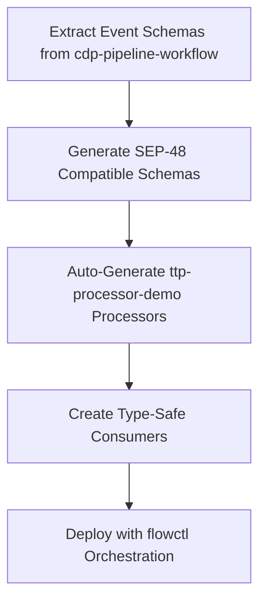

# GitHub Discussion Analysis: SDKs Binding Generation Events

**Discussion:** [stellar/discussions#1765](https://github.com/orgs/stellar/discussions/1765)  
**Topic:** SDKs Binding Generation Events  
**Date:** July 22, 2025  
**Analysis Focus:** Integration opportunities with flowctl, ttp-processor-demo, and cdp-pipeline-workflow migration

## Executive Summary

The GitHub discussion explores standardizing event handling across Stellar SDKs through automated binding generation, particularly for Soroban contract events introduced in Protocol 23. This presents significant opportunities for enhancing our ttp-processor-demo architecture, streamlining the cdp-pipeline-workflow migration, and creating a unified event processing ecosystem.

## Discussion Overview

### Key Technical Context

**Protocol 23 Event Support:**
- SEP-48 Contract Specs now support events in XDR format
- Currently deployed on Testnet with production readiness
- Rust Soroban SDK includes `contractevent` macro for event definitions

**Example Event Structure:**
```rust
#[contractevent]
pub struct Approve {
    #[topic]
    pub from: Address,
    #[topic]
    pub spender: Address,
    pub amount: i128,
    pub live_until_ledger: u32,
}
```

**Proposed Tooling:**
- SDK binding generation for events across multiple languages
- Code generation for alternative formats (protobuf, JSON schemas)
- Automated event processor generation for different SDKs

### Community Consensus
- **Strong Support:** JS SDK maintainer (@Shaptic) endorses the proposal
- **Integration Opportunity:** Alignment with existing SDK binding work
- **Implementation Awareness:** Recognition of complexity in cross-language event generation
- **Ecosystem Impact:** Potential for standardized event handling across Stellar tooling

## Strategic Impact Analysis

### 🚀 flowctl Integration Opportunities

#### 1. **Standardized Event Schema Management**
- **Unified Event Registry:** Flowctl could serve as a central registry for contract event schemas
- **Schema Validation:** Automatic validation of event structures against SEP-48 specifications
- **Version Management:** Track event schema evolution across contract updates

#### 2. **Auto-Generated Processor Pipeline Configuration**
- **Smart Pipeline Generation:** Automatically generate processor configurations based on contract event schemas
- **Type-Safe Routing:** Route events to appropriate processors based on generated type definitions
- **Schema-Driven Filtering:** Use event schemas to create sophisticated filtering rules

#### 3. **Cross-Language Consumer Generation**
```yaml
# Example flowctl configuration
apiVersion: flow.obsrvr.dev/v1
kind: EventProcessor
metadata:
  name: approve-event-processor
spec:
  eventSchema:
    contractId: "CDLZFC3SYJYDZT7K67VZ75HPJVIEUVNIXF47ZG2FB2RMQQASOBNCUEXD"
    eventType: "Approve"
    schemaFormat: "sep48"
  generatedConsumers:
    - language: "typescript"
      outputPath: "./generated/approve-events.ts"
    - language: "go"
      outputPath: "./generated/approve_events.go"
    - language: "python" 
      outputPath: "./generated/approve_events.py"
```

#### 4. **Enhanced Monitoring and Observability**
- **Event-Aware Metrics:** Generate metrics based on event schemas
- **Type-Safe Alerting:** Create alerts using structured event data
- **Dashboard Generation:** Auto-generate monitoring dashboards from event schemas

### ⚙️ ttp-processor-demo Enhancement Opportunities

#### 1. **Contract Invocation Processor Enhancements**
Our newly implemented Contract Invocation Processor can be significantly enhanced:

```go
// Enhanced event processing with generated bindings
type GeneratedEventProcessor struct {
    contractEventParsers map[string]EventParser
    schemaRegistry       *SEP48SchemaRegistry
    typeGenerator        *CrossLanguageGenerator
}

func (g *GeneratedEventProcessor) ProcessContractEvent(
    contractId string, 
    diagnosticEvent *cipb.DiagnosticEvent,
) (*GeneratedContractEvent, error) {
    // Use generated parsers for type-safe event processing
    parser, exists := g.contractEventParsers[contractId]
    if !exists {
        return g.generateParserFromSchema(contractId)
    }
    
    return parser.ParseDiagnosticEvent(diagnosticEvent)
}
```

#### 2. **New Processor Types**
- **Schema-Driven Event Processor:** Automatically process events based on SEP-48 schemas
- **Cross-Contract Event Correlator:** Link related events across different contracts
- **Event Type Filter Processor:** Filter events by generated type definitions

#### 3. **Enhanced Protobuf Integration**
Building on our existing protobuf definitions:

```protobuf
// Extension to contract_invocation_event.proto
message GeneratedContractEvent {
  string contract_id = 1;
  string event_type = 2;
  string schema_version = 3;
  
  // Generated fields based on SEP-48 schema
  map<string, ScValue> topics = 4;
  map<string, ScValue> data_fields = 5;
  
  // Metadata
  SEP48SchemaReference schema_reference = 6;
  ValidationStatus validation_status = 7;
}

message SEP48SchemaReference {
  string schema_hash = 1;
  string schema_url = 2;
  uint32 version = 3;
}
```

#### 4. **Type-Safe Consumer Generation**
Leverage our existing consumer examples to create generated versions:

```typescript
// Generated TypeScript consumer (enhancement to consumer_app/node)
export interface ApproveEvent {
  from: string;      // Address
  spender: string;   // Address  
  amount: bigint;    // i128
  liveUntilLedger: number; // u32
}

export class GeneratedContractEventClient {
  async subscribeToApproveEvents(
    contractId: string,
    callback: (event: ApproveEvent) => void
  ): Promise<void> {
    const stream = this.client.getContractInvocations({
      startLedger: await this.getCurrentLedger(),
      contractIds: [contractId],
      contentFilter: {
        requiredEventTopics: ["Approve"]
      }
    });
    
    stream.on('data', (event) => {
      if (this.isApproveEvent(event)) {
        callback(this.parseApproveEvent(event));
      }
    });
  }
}
```

### 📈 cdp-pipeline-workflow Migration Strategy

#### 1. **Accelerated Migration Path**
The discussion's standardization approach provides a clear migration strategy:

**Current cdp-pipeline-workflow Processors to Migrate:**
- `processor_contract_invocation` → ✅ **Already migrated** (with Phase 3 enhancements)
- `processor_contract_event` → **Enhanced with generated bindings**
- `processor_asset_stats` → **Convert to schema-driven processor**
- `processor_account_activity` → **Leverage generated account event types**
- `processor_dex_trades` → **Use generated DEX event schemas**

#### 2. **Schema-First Migration Approach**


#### 3. **Backward Compatibility Strategy**
- **Dual Processing:** Run both legacy and generated processors during migration
- **Schema Evolution:** Manage schema changes without breaking existing consumers
- **Gradual Rollout:** Processor-by-processor migration with validation

#### 4. **Migration Priority Matrix**
| Processor | Current Complexity | Schema Availability | Migration Priority | Generated Benefits |
|-----------|-------------------|-------------------|-------------------|------------------|
| contract_invocation | ✅ **Complete** | High | ✅ **Done** | Type safety, Protocol 23 |
| contract_event | Medium | High | **High** | Auto-parsing, validation |
| asset_stats | Low | Medium | Medium | Standardized metrics |
| account_activity | High | Low | Low | Complex schema needs |
| dex_trades | Medium | High | **High** | DEX event standardization |

### 🔮 Future Development Opportunities

#### 1. **New Source Types**
- **Schema-Aware Contract Source:** Sources that understand and validate event schemas
- **Multi-Contract Event Aggregator:** Combine events from multiple contracts with schema validation
- **Historical Event Replayer:** Replay events with schema evolution support

#### 2. **Advanced Processor Patterns**
- **Cross-Contract Event Correlator:** Link events across contract boundaries using schema relationships
- **Event State Machine Processor:** Track contract state transitions through events
- **Anomaly Detection Processor:** Detect unusual patterns in structured event data

#### 3. **Next-Generation Sinks/Consumers**
- **Generated Dashboard Consumers:** Auto-generate monitoring dashboards from schemas
- **Type-Safe Database Sinks:** Store events in databases with generated table schemas
- **Real-time Analytics Consumers:** Stream processing with schema-aware aggregations

#### 4. **Ecosystem Integration**
- **Stellar Laboratory Integration:** Link to [stellar/laboratory#1512](https://github.com/stellar/laboratory/issues/1512)
- **CLI Tooling Enhancement:** Align with [stellar/stellar-cli#2086](https://github.com/stellar/stellar-cli/issues/2086)
- **OpenZeppelin Monitor Integration:** Connect with [OpenZeppelin/openzeppelin-monitor#318](https://github.com/OpenZeppelin/openzeppelin-monitor/issues/318)

## Implementation Roadmap

### Phase 4A: Schema Integration Foundation
1. **Integrate SEP-48 Schema Support** into contract invocation processor
2. **Create Schema Registry Service** within flowctl
3. **Extend Protobuf Definitions** for generated event types
4. **Implement Basic Code Generation** for TypeScript and Go

### Phase 4B: Generated Consumer Development  
1. **Enhance Node.js Consumer** with generated event types
2. **Extend Go WASM Consumer** with schema validation
3. **Create Python Consumer** using generated bindings
4. **Develop Rust Consumer** leveraging existing Soroban SDK patterns

### Phase 4C: cdp-pipeline-workflow Migration Acceleration
1. **Extract Event Schemas** from existing processors
2. **Generate Migration-Ready Processors** using schema-driven approach
3. **Create Migration Tooling** for semi-automated conversion
4. **Validate Migration Results** with parallel processing

### Phase 4D: Advanced Features
1. **Cross-Contract Event Correlation**
2. **Real-time Schema Evolution** handling
3. **Advanced Analytics Pipeline** generation
4. **Enterprise Integration Patterns**

## Technical Requirements

### Development Dependencies
- **SEP-48 Schema Parser:** For contract event schema interpretation  
- **Code Generation Framework:** Multi-language binding generation
- **Schema Registry:** Version and evolution management
- **Type Validation Library:** Runtime schema validation

### Infrastructure Requirements
- **Schema Storage:** Distributed schema registry with versioning
- **Code Generation Pipeline:** CI/CD integration for binding generation
- **Testing Framework:** Schema compatibility testing across languages
- **Monitoring Integration:** Schema-aware observability

### Performance Considerations
- **Generated Code Optimization:** Ensure generated parsers are performant
- **Schema Caching:** Cache schemas and generated code for performance
- **Streaming Compatibility:** Ensure generated code works with existing streaming architecture
- **Memory Management:** Optimize for high-volume event processing

## Risk Assessment and Mitigation

### Technical Risks
1. **Schema Evolution Complexity:** Manage breaking changes in event schemas
   - **Mitigation:** Versioned schema registry with compatibility checking
2. **Cross-Language Consistency:** Ensure generated bindings behave consistently
   - **Mitigation:** Comprehensive integration testing across languages
3. **Performance Impact:** Generated code may be slower than hand-optimized parsers
   - **Mitigation:** Benchmarking and optimization of generation templates

### Migration Risks  
1. **Parallel Processing Overhead:** Running dual processors during migration
   - **Mitigation:** Gradual rollout with careful resource monitoring
2. **Schema Discovery Difficulty:** Some events may not have clear schemas
   - **Mitigation:** Manual schema creation for complex cases
3. **Consumer Breaking Changes:** Generated consumers may break existing integrations
   - **Mitigation:** Versioned consumer APIs with backward compatibility

## Expected Benefits

### Developer Experience
- **Type Safety:** Compile-time event validation across languages
- **Reduced Boilerplate:** Auto-generated event parsing and handling
- **Consistent APIs:** Unified event handling patterns across languages
- **Documentation Generation:** Auto-generated docs from schemas

### Operational Benefits
- **Faster Development:** Reduced time to market for new event processors
- **Lower Maintenance:** Schema-driven updates reduce manual maintenance
- **Better Testing:** Generated test cases for event validation
- **Improved Monitoring:** Schema-aware metrics and alerting

### Ecosystem Impact
- **Standardization:** Unified event handling across Stellar tooling
- **Interoperability:** Easier integration between different Stellar projects
- **Community Growth:** Lower barrier to entry for new developers
- **Innovation Acceleration:** Focus on business logic rather than event parsing

## Conclusion

The SDKs Binding Generation Events discussion presents a transformative opportunity for our ttp-processor-demo architecture. By embracing schema-driven event processing, we can:

1. **Accelerate Migration:** Systematic approach to moving processors from cdp-pipeline-workflow
2. **Improve Developer Experience:** Type-safe, auto-generated event handling
3. **Enable Innovation:** Focus on advanced processing logic rather than parsing boilerplate
4. **Future-Proof Architecture:** Schema evolution and multi-language support

The integration of this approach with our existing Contract Invocation Processor, combined with flowctl's orchestration capabilities, positions us to create a leading-edge Stellar data processing platform that can adapt and scale with the evolving Soroban ecosystem.

**Recommendation:** Prioritize integration of SEP-48 schema support as a foundational enhancement to Phase 4 development, enabling both immediate benefits and long-term strategic advantages.

---

*Analysis prepared for ttp-processor-demo strategic planning*  
*Generated with [Claude Code](https://claude.ai/code)*

*Co-Authored-By: Claude <noreply@anthropic.com>*